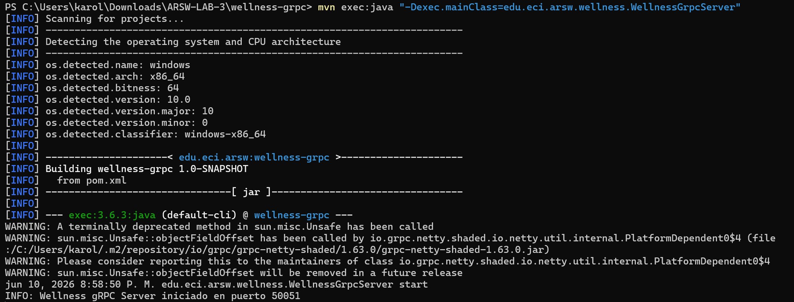

# Laboratorio 03

### Sistema de Gestión de Salones

### Descripcion
Diseñe e implemente un servidor TCP para gestionar la reserva de salones de la Escuela. Este ejercicio debe reutilizar el estilo cliente-servidor, pero no debe copiar literalmente el caso de películas.

### Requisitos funcionales 
- El servidor debe mantener en memoria una lista inicial de salones: E301, E302, E303 y E304. 
- Cada salón puede estar disponible o reservado.
- El cliente debe poder consultar el estado de un salón.
- El cliente debe poder reservar un salón disponible.
- El cliente debe poder liberar un salón reservado

### Pruebas

Cliente

Servidor

El servidor debe mantener en memoria una lista

Cada salón puede estar disponible o reservado.

Dispoonible

Reservado

El cliente debe poder consultar el estado de un salón.

El cliente debe poder reservar un salón disponible.

El cliente debe poder liberar un salón reservado

Error salon no existe y Operacion invalida

### Preguntas de reflexión

- ¿Qué tan fácil sería agregar una nueva operación al protocolo?

    Es fácil pero con varios puntos de cambio obligatorios que aumentan el riesgo de errores.
    Cambios necesarios para agregar, por ejemplo, una operación `UPDATE_CAPACITY:id:nuevaCapacidad:`
    | Archivo | Líneas a modificar |
    |----------|-------------------|
    | `RoomServer.java` | 1. Agregar `case "UPDATE_CAPACITY"` en el `switch` (línea ~45) 2. Crear método `handleUpdateCapacity()` 3. Agregar validación de formato |
    | `Room.java` | Agregar método `setCapacity(int capacity)` |
    | `RoomClient.java` | 1. Agregar opción en el menú (líneas ~15-20) 2. Agregar lógica de construcción del comando |

    Vulnerabilidad crítica: Si agregas una operación en el servidor pero NO actualizas el cliente, este último enviará mensajes que el servidor rechazará con `"ERROR: Comando desconocido"`. No hay manera de que el cliente "descubra" automáticamente las operaciones disponibles.

- ¿Qué ocurre si dos clientes intentan reservar el mismo salón al mismo tiempo?

    HAY UNA CONDICIÓN DE CARRERA (RACE CONDITION) GRAVE POR LO QUE PASARIA ESTO:

    TIEMPO | Cliente A (Juan)        | Cliente B (Maria)        | Estado Salón E301
    -------|-------------------------|--------------------------|------------------
    T1     | handleReserve("E301")   |                          | reserved = false
    T2     | room = findById("E301") |                          | reserved = false
    T3     | room.reserve("Juan")    |                          | 
    T4     |   Lee: reserved = false |                          | reserved = false
    T5     |   Evalúa: !reserved=True|                          | reserved = false
    T6     |                          | handleReserve("E301")    | reserved = false
    T7     |                          | room = findById("E301")  | reserved = false
    T8     |                          | room.reserve("Maria")    | reserved = false
    T9     |                          |   Lee: reserved = false  | reserved = false
    T10    |   reserved = true        |                          | reserved = true (Juan)
    T11    |   reservedBy = "Juan"    |                          | reservedBy = "Juan"
    T12    |                          |   reserved = true        | reserved = true
    T13    |                          |   reservedBy = "Maria"   | reservedBy = "Maria" SOBRESCRIBE!
    T14    | Devuelve true (OK)       | Devuelve true (OK)       | AMBOS creen que reservaron

- ¿Dónde está definido realmente el contrato de comunicación: en un archivo formal o en convenciones de texto?

    El contrato está fragmentado en 4 lugares diferentes, todos informales y ninguno enforceable automáticamente.

    | Ubicación | Lo que define | Ejemplo en el código |
    |-----------|---------------|----------------------|
    | **Servidor (líneas 12-14)** | Comandos y formato | `System.out.println("GET_ROOM:id");` |
    | **Servidor (switch líneas 45-52)** | Comandos válidos | `case "GET_ROOM":` `case "RESERVE":` |
    | **Servidor (métodos handler)** | Formato específico | `if (parts.length < 2) return "ERROR: Formato inválido. Use GET_ROOM:id";` |
    | **Cliente (líneas 23-26)** | Mapeo de comandos | `if (input.equalsIgnoreCase("list")) input = "LIST_ROOMS";` |
    | **Cliente (mensajes de ayuda)** | Documentación para usuario | `System.out.println("1. Consultar salón (GET_ROOM:id)");` |

### Gestión de Salones vía HTTP

### Descripcion

Transforme el ejercicio de gestión de salones para que funcione mediante HTTP. No es necesario construir una interfaz gráfica; puede probar con navegador, curl o Postman.

### URL
Desde el navegador:

Listar todos los salones: http://localhost:8080/rooms 
Ver detalle de un salón: http://localhost:8080/rooms?id=E303

### Pruebas De Rutas Requeridas

Ejecutamos

Entramos a la URL

Reservamos Damos clic en reservar 

Dejamos libre clic en liberar

Ver un salon en especifico Disponible y No Disponible 
 

### Pruebas Postman

Ver lista de salones

Ver detalles de algun salon

Reservar un salon

Liberar un salon

### Preguntas de reflexión

- ¿Qué ventajas ofrece HTTP frente a un protocolo de texto definido manualmente?

    Estandarización universal 
    Soporte nativo en navegadores 
    Caché, autenticación y compresión ya resueltos 
    Herramientas existentes (`curl`, Postman, navegador)

- ¿Qué limitaciones tiene construir un servidor HTTP sin framework?

    Manejo manual de rutas, parámetros, headers 
    Sin soporte para HTTPS, sesiones, formularios complejos 
    Mayor código boilerplate 
    Vulnerabilidades de seguridad potenciales

- ¿Cómo cambiaría esta solución si se usara JSON en lugar de HTML?

    Mejor para APIs REST 
    Clientes más ligeros (aplicaciones móviles, SPA) 
    Fácil integración con frameworks frontend

### Inventario de Laboratorios

### Descripcion

Implemente un sistema RMI para consultar y reservar equipos de laboratorio. El objetivo es diseñar una interfaz remota coherente y no depender de protocolos textuales.

### Pruebas de Datos mínimos

Corremos el server

Corremos el cliente

Listamos todos los equipos

Consultamos el equipo por el codigo

Reservamos un equipo

Liberamos el equipo

Salimos 

### Preguntas de reflexión
- ¿Qué cambió al pasar de HTTP a RMI?

    En HTTP teníamos que parsear URLs y parámetros manualmente 
    En RMI invocamos métodos directamente como si estuvieran locales 
    RMI oculta toda la complejidad de serialización y transporte

- ¿Dónde está definido el contrato de comunicación?

    En la interfaz LaboratoryService que extiende Remote 
    Cada método debe declarar throws RemoteException

- ¿Qué problemas tendría este sistema si un cliente no está escrito en Java?

    RMI es específico de Java (uso de Remote, UnicastRemoteObject) 
    La serialización Java no es interoperable 
    No se podría consumir desde Python, JavaScript, etc.

### Sistema de Bienestar Universitario con gRPC

### Descripcion

Diseñe e implemente un servicio gRPC para gestionar solicitudes de citas de bienestar universitario. Este ejercicio evalúa la capacidad de modelar contratos y no solamente de modificar nombres de clases.

### Entidades mínimas
- Student: id, name, institutionalEmail.
- Appointment: id, studentId, serviceType, date, status.
- ServiceType: MEDICINE, PSYCHOLOGY, DENTISTRY.
- Status: REQUESTED, CANCELLED, ATTENDED.

### Reglas
- Una cita solicitada debe quedar en estado REQUESTED.
- Una cita cancelada no debe aparecer como activa.
- El sistema debe permitir consultar las citas de un estudiante.
- La información se debe mantener en memoria.

### Pruebas

Servidor

