# Laboratorio 03

### Sistema de Gestión de Salones

### Descripcion
Diseñe e implemente un servidor TCP para gestionar la reserva de salones de la Escuela. Este ejercicio debe reutilizar el estilo cliente-servidor, pero no debe copiar literalmente el caso de películas.

### Requisitos funcionales 
- El servidor debe mantener en memoria una lista inicial de salones: E301, E302, E303 y E304. 
- Cada salón puede estar disponible o reservado.
- El cliente debe poder consultar el estado de un salón.
- El cliente debe poder reservar un salón disponible.
- El cliente debe poder liberar un salón reservado

### Pruebas

Cliente
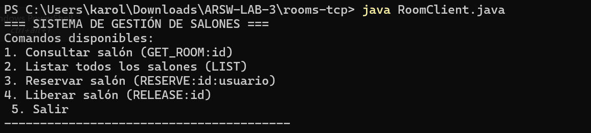

Servidor
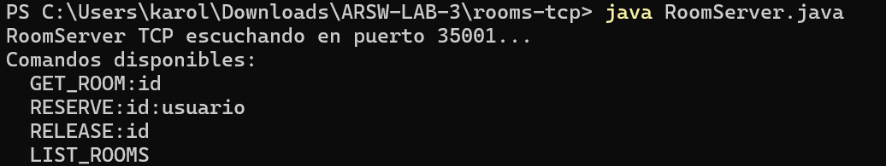

El servidor debe mantener en memoria una lista

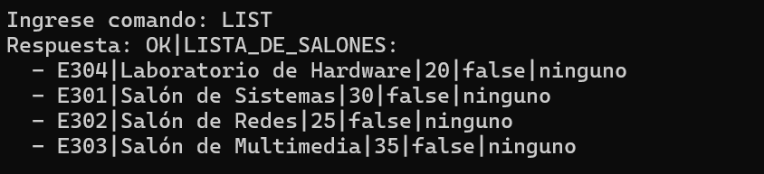

Cada salón puede estar disponible o reservado.

Dispoonible

Reservado


El cliente debe poder consultar el estado de un salón.


El cliente debe poder reservar un salón disponible.


El cliente debe poder liberar un salón reservado


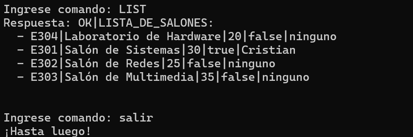

Error salon no existe y Operacion invalida

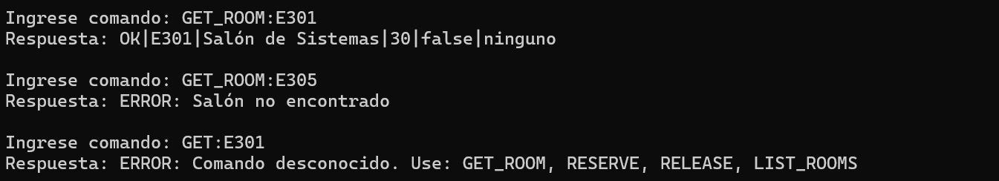

### Preguntas de reflexión

- ¿Qué tan fácil sería agregar una nueva operación al protocolo?

    Es fácil pero con varios puntos de cambio obligatorios que aumentan el riesgo de errores.
    Cambios necesarios para agregar, por ejemplo, una operación `UPDATE_CAPACITY:id:nuevaCapacidad:`
    | Archivo | Líneas a modificar |
    |----------|-------------------|
    | `RoomServer.java` | 1. Agregar `case "UPDATE_CAPACITY"` en el `switch` (línea ~45)<br>2. Crear método `handleUpdateCapacity()`<br>3. Agregar validación de formato |
    | `Room.java` | Agregar método `setCapacity(int capacity)` |
    | `RoomClient.java` | 1. Agregar opción en el menú (líneas ~15-20)<br>2. Agregar lógica de construcción del comando |

    Vulnerabilidad crítica: Si agregas una operación en el servidor pero NO actualizas el cliente, este último enviará mensajes que el servidor rechazará con `"ERROR: Comando desconocido"`. No hay manera de que el cliente "descubra" automáticamente las operaciones disponibles.

- ¿Qué ocurre si dos clientes intentan reservar el mismo salón al mismo tiempo?

    HAY UNA CONDICIÓN DE CARRERA (RACE CONDITION) GRAVE POR LO QUE PASARIA ESTO:

    TIEMPO | Cliente A (Juan)        | Cliente B (Maria)        | Estado Salón E301
    -------|-------------------------|--------------------------|------------------
    T1     | handleReserve("E301")   |                          | reserved = false
    T2     | room = findById("E301") |                          | reserved = false
    T3     | room.reserve("Juan")    |                          | 
    T4     |   Lee: reserved = false |                          | reserved = false
    T5     |   Evalúa: !reserved=True|                          | reserved = false
    T6     |                          | handleReserve("E301")    | reserved = false
    T7     |                          | room = findById("E301")  | reserved = false
    T8     |                          | room.reserve("Maria")    | reserved = false
    T9     |                          |   Lee: reserved = false  | reserved = false
    T10    |   reserved = true        |                          | reserved = true (Juan)
    T11    |   reservedBy = "Juan"    |                          | reservedBy = "Juan"
    T12    |                          |   reserved = true        | reserved = true
    T13    |                          |   reservedBy = "Maria"   | reservedBy = "Maria" SOBRESCRIBE!
    T14    | Devuelve true (OK)       | Devuelve true (OK)       | AMBOS creen que reservaron

- ¿Dónde está definido realmente el contrato de comunicación: en un archivo formal o en convenciones de texto?

    El contrato está fragmentado en 4 lugares diferentes, todos informales y ninguno enforceable automáticamente.

    | Ubicación | Lo que define | Ejemplo en el código |
    |-----------|---------------|----------------------|
    | **Servidor (líneas 12-14)** | Comandos y formato | `System.out.println("GET_ROOM:id");` |
    | **Servidor (switch líneas 45-52)** | Comandos válidos | `case "GET_ROOM":`<br>`case "RESERVE":` |
    | **Servidor (métodos handler)** | Formato específico | `if (parts.length < 2) return "ERROR: Formato inválido. Use GET_ROOM:id";` |
    | **Cliente (líneas 23-26)** | Mapeo de comandos | `if (input.equalsIgnoreCase("list")) input = "LIST_ROOMS";` |
    | **Cliente (mensajes de ayuda)** | Documentación para usuario | `System.out.println("1. Consultar salón (GET_ROOM:id)");` |


### Gestión de Salones vía HTTP

### Descripcion

Transforme el ejercicio de gestión de salones para que funcione mediante HTTP. No es necesario construir una interfaz gráfica; puede probar con navegador, curl o Postman.

### URL
Desde el navegador:

Listar todos los salones: http://localhost:8080/rooms<br>
Ver detalle de un salón: http://localhost:8080/rooms?id=E303

### Pruebas De Rutas Requeridas

Ejecutamos
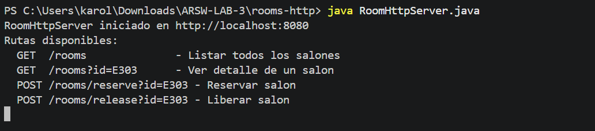

Entramos a la URL
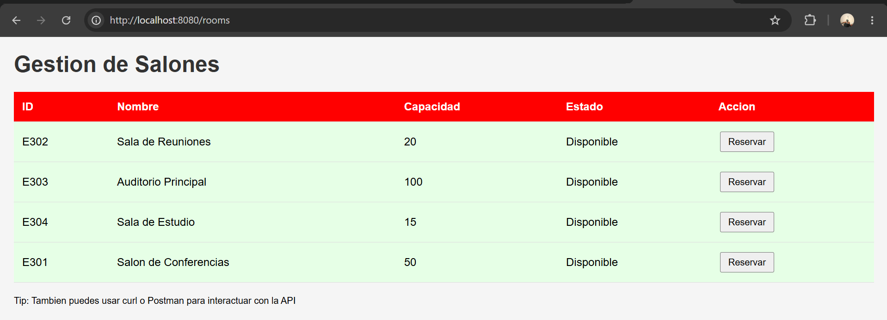

Reservamos Damos clic en reservar 
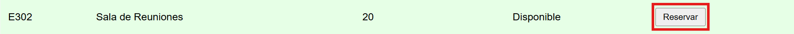
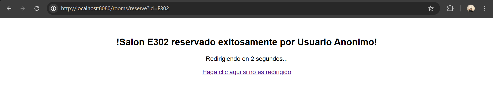

Dejamos libre clic en liberar
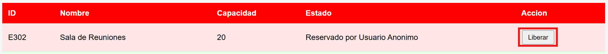
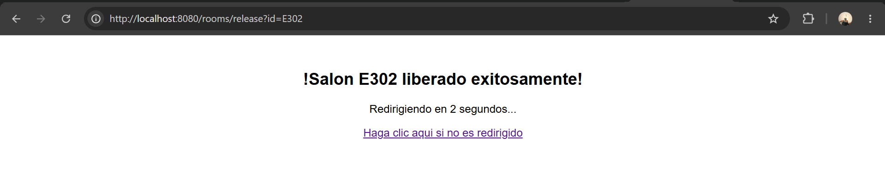

Ver un salon en especifico Disponible y No Disponible 
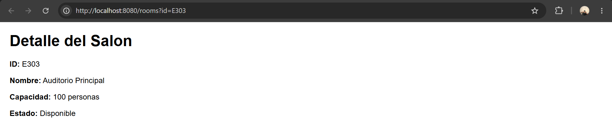 
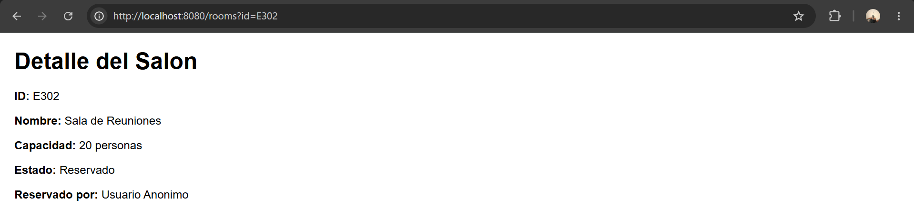

### Pruebas Postman

Ver lista de salones
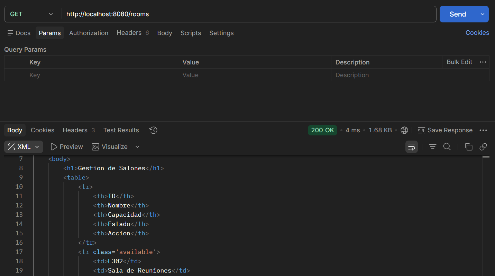

Ver detalles de algun salon
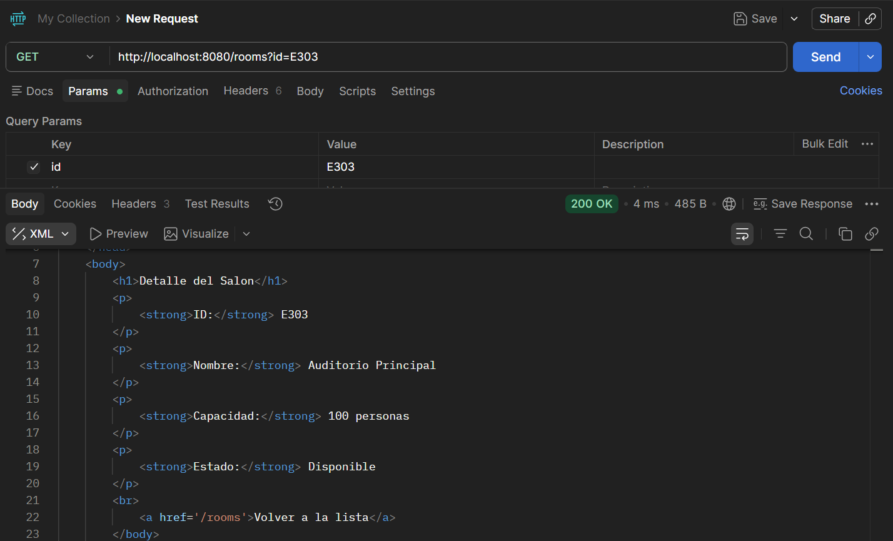

Reservar un salon
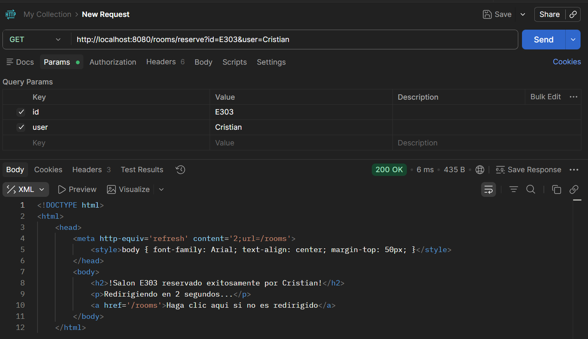

Liberar un salon
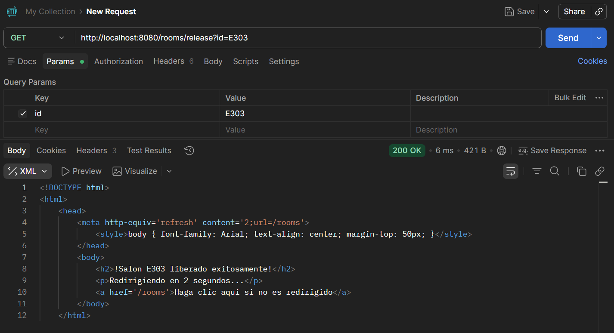

### Preguntas de reflexión

- ¿Qué ventajas ofrece HTTP frente a un protocolo de texto definido manualmente?

    Estandarización universal<br>
    Soporte nativo en navegadores<br>
    Caché, autenticación y compresión ya resueltos<br>
    Herramientas existentes (`curl`, Postman, navegador)

- ¿Qué limitaciones tiene construir un servidor HTTP sin framework?

    Manejo manual de rutas, parámetros, headers<br>
    Sin soporte para HTTPS, sesiones, formularios complejos<br>
    Mayor código boilerplate<br>
    Vulnerabilidades de seguridad potenciales

- ¿Cómo cambiaría esta solución si se usara JSON en lugar de HTML?

    Mejor para APIs REST<br>
    Clientes más ligeros (aplicaciones móviles, SPA)<br>
    Fácil integración con frameworks frontend

### Inventario de Laboratorios

### Descripcion

Implemente un sistema RMI para consultar y reservar equipos de laboratorio. El objetivo es diseñar una interfaz remota coherente y no depender de protocolos textuales.

### Pruebas de Datos mínimos

Corremos el server
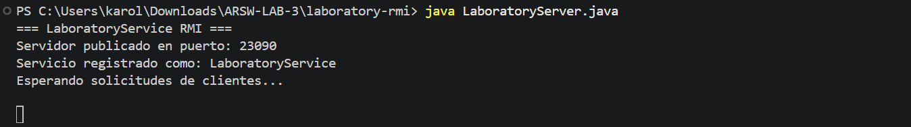

Corremos el cliente
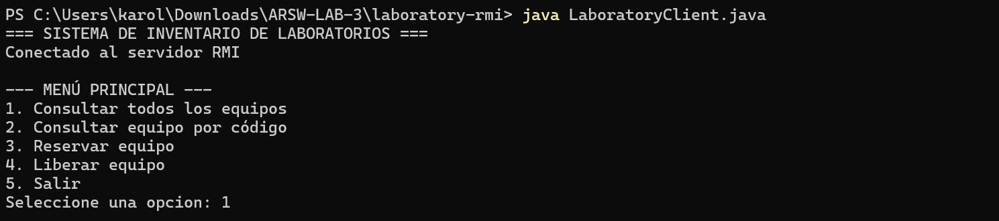

Listamos todos los equipos
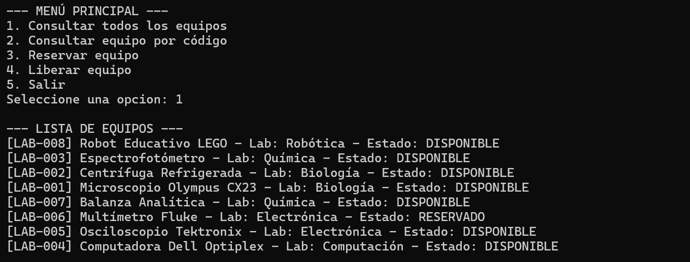

Consultamos el equipo por el codigo
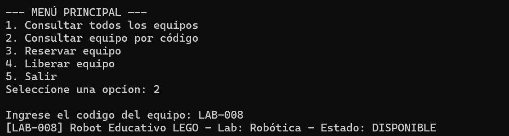

Reservamos un equipo
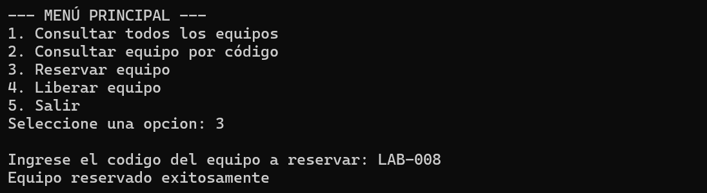

Liberamos el equipo
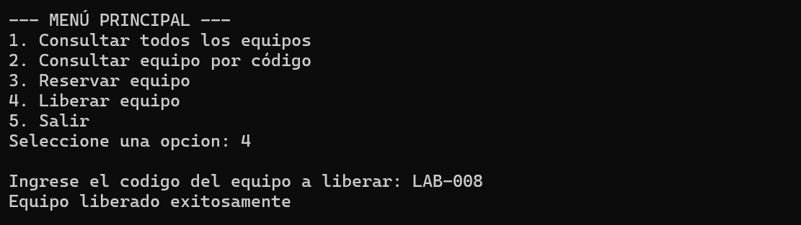

Salimos 
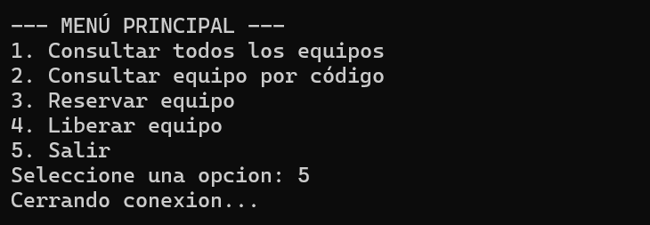

### Preguntas de reflexión
- ¿Qué cambió al pasar de HTTP a RMI?

    En HTTP teníamos que parsear URLs y parámetros manualmente<br>
    En RMI invocamos métodos directamente como si estuvieran locales<br>
    RMI oculta toda la complejidad de serialización y transporte

- ¿Dónde está definido el contrato de comunicación?

    En la interfaz LaboratoryService que extiende Remote<br>
    Cada método debe declarar throws RemoteException

- ¿Qué problemas tendría este sistema si un cliente no está escrito en Java?

    RMI es específico de Java (uso de Remote, UnicastRemoteObject)<br>
    La serialización Java no es interoperable<br>
    No se podría consumir desde Python, JavaScript, etc.

### Sistema de Bienestar Universitario con gRPC

### Descripcion

Diseñe e implemente un servicio gRPC para gestionar solicitudes de citas de bienestar universitario. Este ejercicio evalúa la capacidad de modelar contratos y no solamente de modificar nombres de clases.

### Entidades mínimas
- Student: id, name, institutionalEmail.
- Appointment: id, studentId, serviceType, date, status.
- ServiceType: MEDICINE, PSYCHOLOGY, DENTISTRY.
- Status: REQUESTED, CANCELLED, ATTENDED.

### Reglas
- Una cita solicitada debe quedar en estado REQUESTED.
- Una cita cancelada no debe aparecer como activa.
- El sistema debe permitir consultar las citas de un estudiante.
- La información se debe mantener en memoria.

### Pruebas

Servidor


Cliente

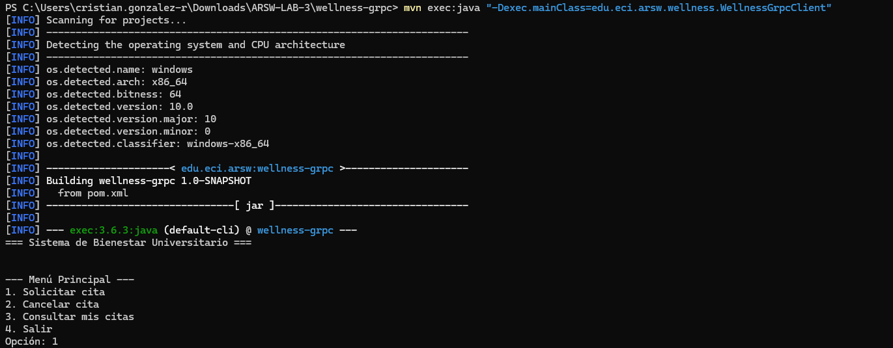

Solicitar Cita


Consultar Cita

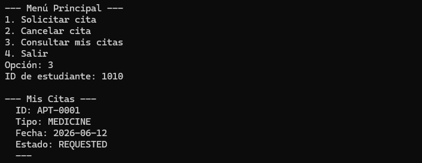

Cancelar Cita

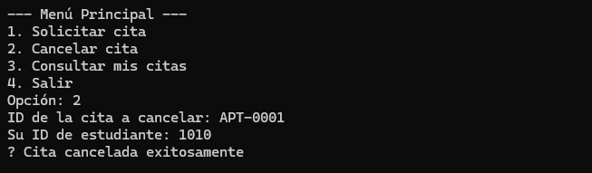

Consultar Citas Canceladas

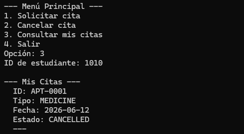

Salir

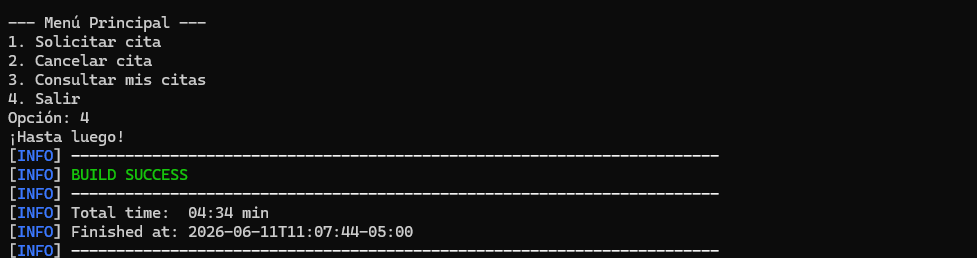

### Preguntas de reflexión

- ¿Por qué el archivo .proto se considera un contrato?

    Define de forma estricta y agnóstica al lenguaje las operaciones, tipos de datos, formatos de mensaje y reglas de serialización. Cambiar el .proto implica un cambio contractual.

- ¿Qué tan fácil sería crear un cliente en otro lenguaje?

    Muy fácil: solo se necesita el mismo .proto y usar el generador de código para Python, Go, C#, etc. La comunicación es independiente del lenguaje del servidor.

- ¿Qué diferencias encuentra entre RMI y gRPC?

    | Característica | RMI | gRPC |
    |---------------|-----|------|
    | Lenguajes | Solo Java | Multi-lenguaje |
    | Contrato | Interfaz Java | Archivo `.proto` |
    | Serialización | Java Serialization | Protocol Buffers |
    | Streaming | Limitado | Bidireccional, server streaming y client streaming |
    | HTTP/2 | No | Sí |

### Descomposición de Bienestar Universitario

### Descripcion

A partir del ejercicio gRPC de citas de bienestar, proponga e implemente una descomposición inicial en microservicios. La solución debe priorizar claridad arquitectónica, no cantidad de líneas de código.

### Producto esperado
- Diagrama de microservicios.
- Descripción de la responsabilidad de cada servicio.
- Al menos dos servicios implementados y ejecutándose en puertos distintos.
- Cliente que consuma directamente los servicios implementados.

### Prender los microservicios

Appointment Service (Puerto 50051)<br>
mvn -pl appointment-service exec:java "-Dexec.mainClass=edu.eci.arsw.wellness.appointment.AppointmentServer"

Medical Service (Puerto 50052)<br>
mvn -pl medical-service exec:java "-Dexec.mainClass=edu.eci.arsw.wellness.medical.MedicalServer"

Gym Service (Puerto 50053)<br>
mvn -pl gym-service exec:java "-Dexec.mainClass=edu.eci.arsw.wellness.gym.GymServer"

Recreation Service (Puerto 50054)<br>
mvn -pl recreation-service exec:java "-Dexec.mainClass=edu.eci.arsw.wellness.recreation.RecreationServer"

Wellness Client<br>
mvn -pl wellness-client exec:java "-Dexec.mainClass=edu.eci.arsw.wellness.client.WellnessClient"

### Pruebas

Prendemos todos los servicios 

- Gestionar citas médicas, psicológicas y odontológicas
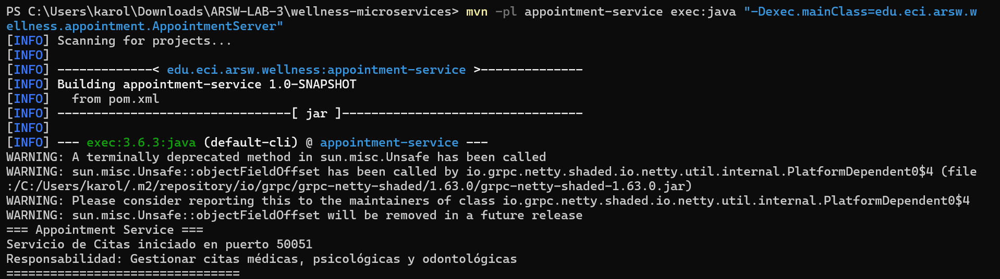

- Información de especialidades médicas y doctores disponibles
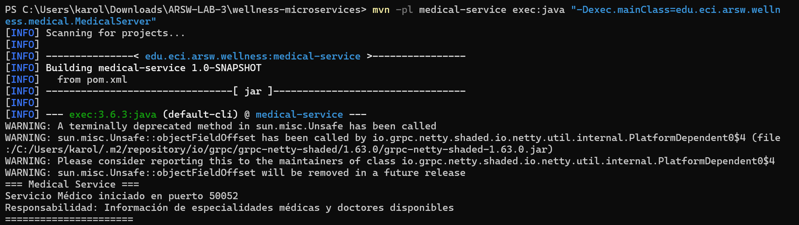

- Gestionar reservas de sesiones de gimnasio
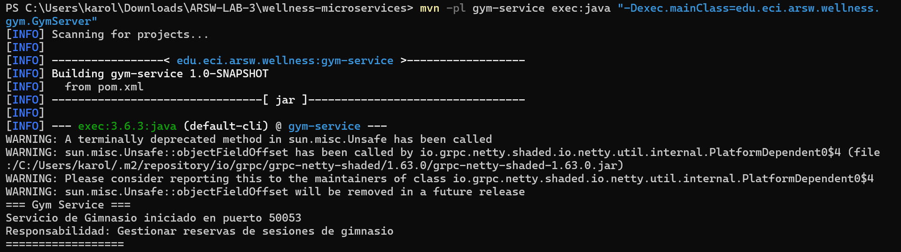

- Gestionar préstamo de recursos recreativos
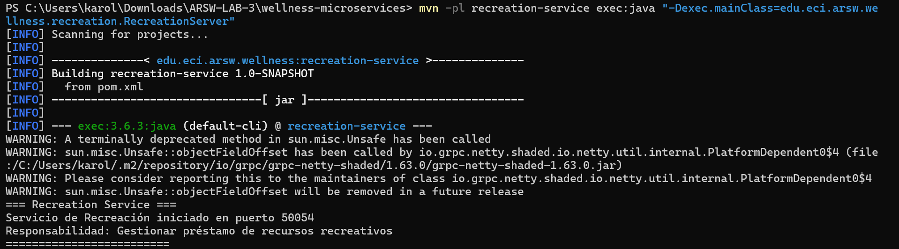

- Cliente
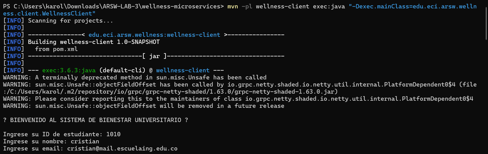

Pruebas de todos los microservicios

- Solicitud cita medica
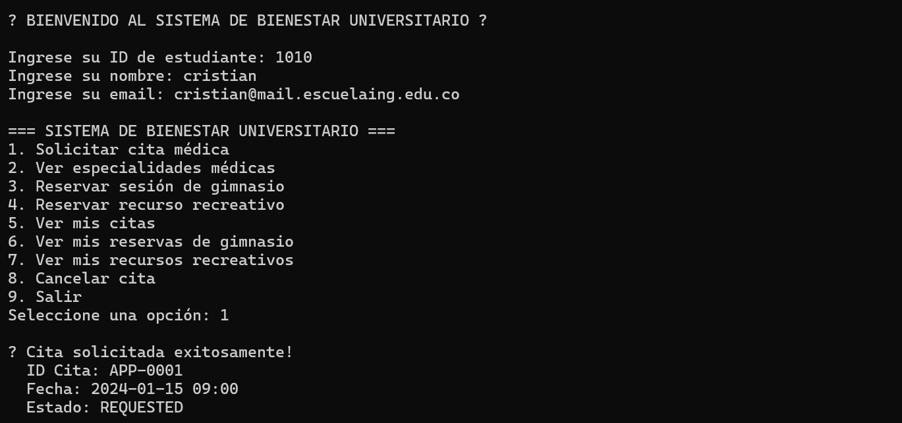

- Ver especialidades médicas
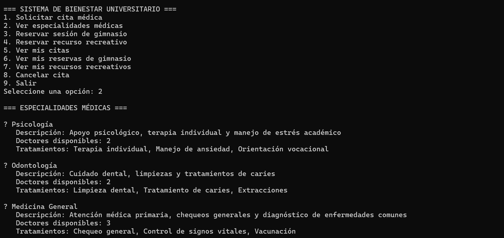

- Reservar sesión de gimnasio
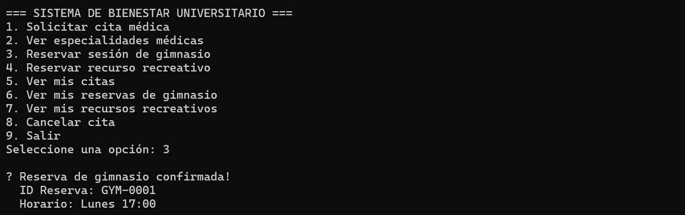

- Reservar recurso recreativo


- Ver mis citas
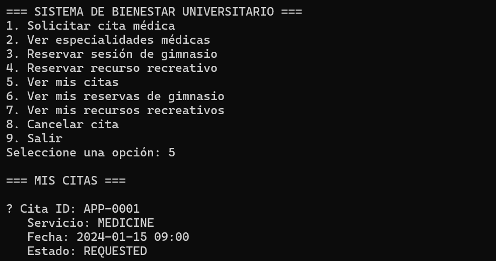

- Ver mis reservas de gimnasio
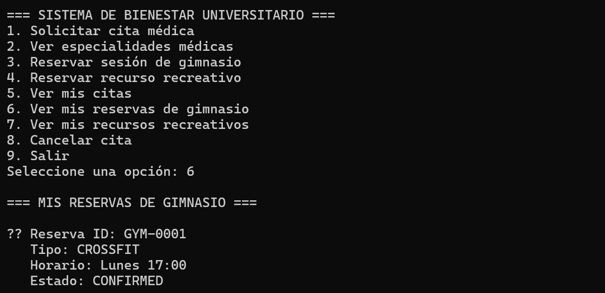

- Ver mis recursos recreativos


Prueba cuando apagamos algun microservicio en este caso el Solicitar cita médica

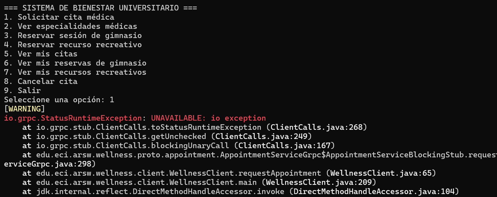

### Preguntas de reflexión

- ¿Por qué decidió separar esos servicios y no otros?

    La decisión de separar los servicios en AppointmentService, MedicalService, GymService y RecreationService se basó en los siguientes criterios:

    Criterio de Responsabilidad Única (Single Responsibility)<br>
    AppointmentService: Gestiona el ciclo de vida completo de las citas (solicitud, cancelación, consulta). Es el núcleo del negocio de bienestar.

    MedicalService: Maneja información estática y de referencia (especialidades, doctores). No cambia con frecuencia.

    GymService: Administra recursos con capacidad limitada y reglas de reserva específicas (aforo máximo, horarios).

    RecreationService: Gestiona inventario de recursos físicos prestables con reglas de devolución.

    Criterio de Frecuencia de Cambio<br>
    Los servicios médicos cambian por nuevas especialidades o doctores (baja frecuencia)

    Las citas cambian constantemente (alta frecuencia)

    El inventario recreativo cambia por préstamos y devoluciones (frecuencia media)

    Criterio de Escalabilidad<br> 
    AppointmentService necesitará más réplicas en horas pico (inicio de semestre)

    GymService requiere control estricto de concurrencia por capacidad limitada

    MedicalService es mayormente consulta, puede tener muchas réplicas

    ¿Por qué no separar más?<br>
    Podría haberse separado AppointmentService en dos (Citas Médicas, Psicológicas, Odontológicas), pero compartirían la misma lógica de agendamiento. La separación actual es suficiente

- ¿Qué datos pertenecen a cada servicio?

    AppointmentService (Responsabilidad: Gestión de citas)

    Datos propios:<br> 
    ├── appointments (Map<String, AppointmentInfo>)<br> 
    │   ├── id, studentId, studentName<br> 
    │   ├── serviceType (MEDICINE, PSYCHOLOGY, DENTISTRY)<br> 
    │   ├── scheduledDate, status<br> 
    │   └── creationTimestamp<br> 
    ├── studentAppointments (Map<String, List<String>>)<br> 
    └── availableSlots (Map<ServiceType, List<String>>)

    MedicalService (Responsabilidad: Información médica)

    Datos propios:<br> 
    ├── specialties (Map<String, SpecialtyInfo>)<br> 
    │   ├── name, description<br> 
    │   ├── availableDoctors<br> 
    │   └── commonTreatments<br> 
    └── doctorsBySpecialty (Map<String, List<DoctorInfo>>)<br> 
        ├── doctorId, name, specialty<br> 
        ├── schedule, available

    GymService (Responsabilidad: Reservas de gimnasio)

    Datos propios:<br> 
    ├── reservations (Map<String, GymReservationInfo>)<br> 
    │   ├── id, studentId, studentName<br> 
    │   ├── timeSlot, sessionType<br> 
    │   └── status<br> 
    ├── sessionCapacity (Map<String, Integer>)<br> 
    ├── currentOccupancy (Map<String, Integer>)<br> 
    └── studentReservations (Map<String, List<String>>)

    RecreationService (Responsabilidad: Préstamo recreativo)

    Datos propios:<br> 
    ├── reservations (Map<String, ResourceReservationInfo>)<br> 
    │   ├── id, studentId, studentName<br> 
    │   ├── resourceId, resourceType<br> 
    │   ├── reservedAt, returnDeadline<br> 
    │   └── status<br> 
    ├── availableResources (Map<String, Integer>)<br> 
    └── studentReservations (Map<String, List<String>>)


- ¿Qué riesgo aparece cuando el cliente conoce todos los servicios?

    | Riesgo | Descripción |
    |---------|-------------|
    | Acoplamiento fuerte | El cliente debe conocer 4 puertos, 4 IPs y 4 contratos. |
    | Fallo en cascada | Si un servicio falla, la funcionalidad asociada deja de estar disponible. |
    | Latencia acumulada | El cliente realiza 4 llamadas separadas, aumentando el tiempo total de respuesta. |
    | Dificultad de evolución | Modificar un servicio puede requerir actualizar todos los clientes. |

### Diagrama

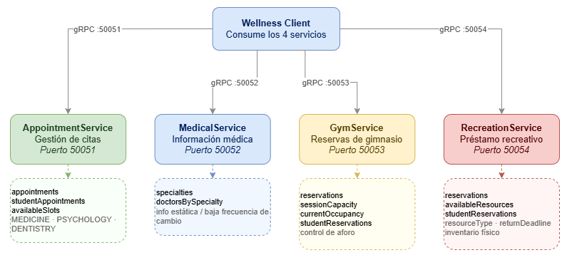

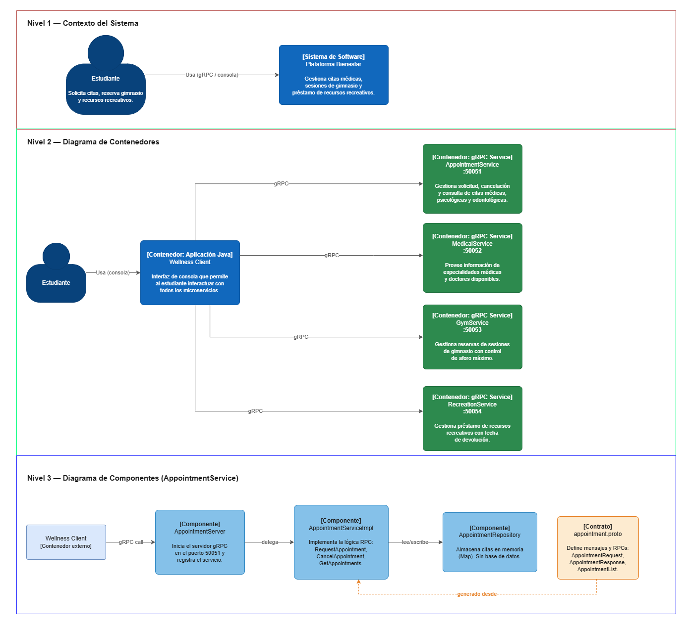

### WellnessGateway

### Descripcion

Construya un Gateway para centralizar el acceso a los servicios del sistema de bienestar universitario

### Servicios internos
- AppointmentService
- MedicalService
- GymService
- RecreationService

### Prendemos todo.

Compilar todo el proyecto (desde la raíz wellness-platform)

mvn clean compile

Appointment Service (Puerto 50051)

mvn exec:java -pl appointment-service "-Dexec.mainClass=edu.eci.arsw.wellness.appointment.AppointmentServer"

Medical Service (Puerto 50052)

mvn exec:java -pl medical-service "-Dexec.mainClass=edu.eci.arsw.wellness.medical.MedicalServer"

Gym Service (Puerto 50053)

mvn exec:java -pl gym-service "-Dexec.mainClass=edu.eci.arsw.wellness.gym.GymServer"

Recreation Service (Puerto 50054)

mvn exec:java -pl recreation-service "-Dexec.mainClass=edu.eci.arsw.wellness.recreation.RecreationServer"

API Gateway (Interfaz unificada)

mvn exec:java -pl wellness-gateway "-Dexec.mainClass=edu.eci.arsw.wellness.gateway.GatewayConsole"

### Pruebas

Prendemos todos los microservicios y el apigatwey

Gestionar citas médicas, psicológicas y odontológicas
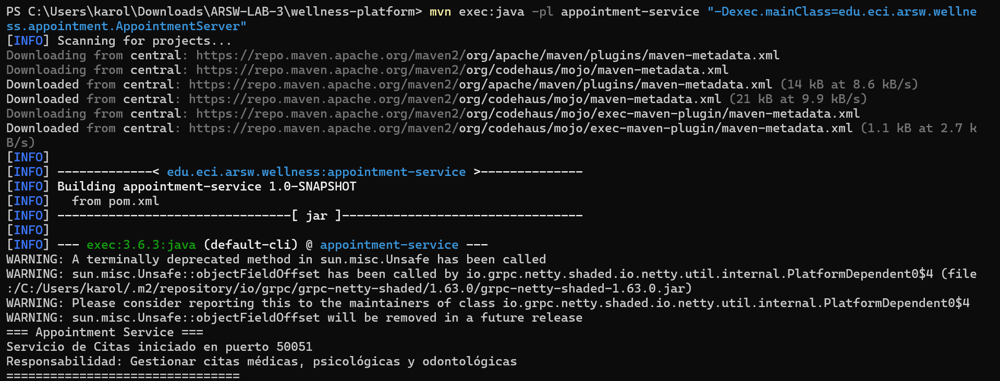

Información de especialidades médicas
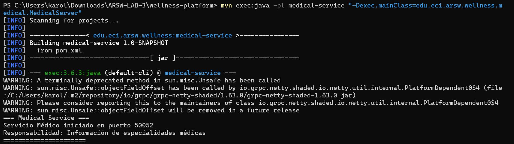

Servicio de Gimnasio
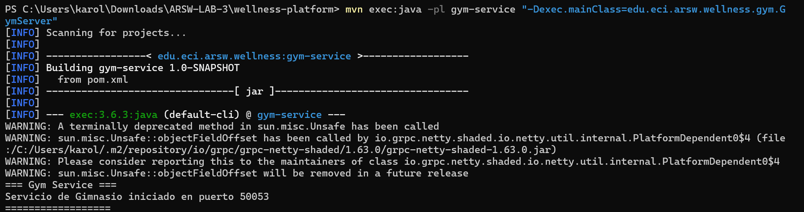

Servicio de Recreación
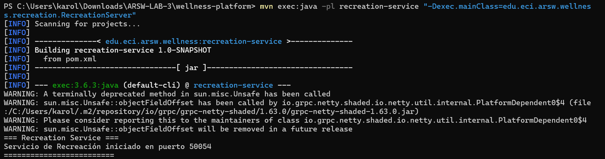

ApiGateway
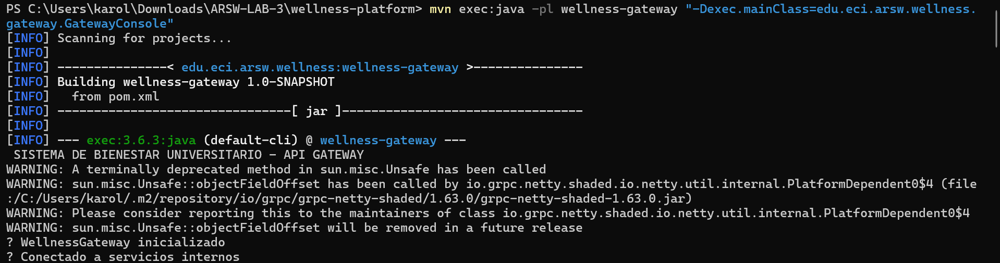

Pruebas de todos los servicios:

1. Solicitar cita médica
    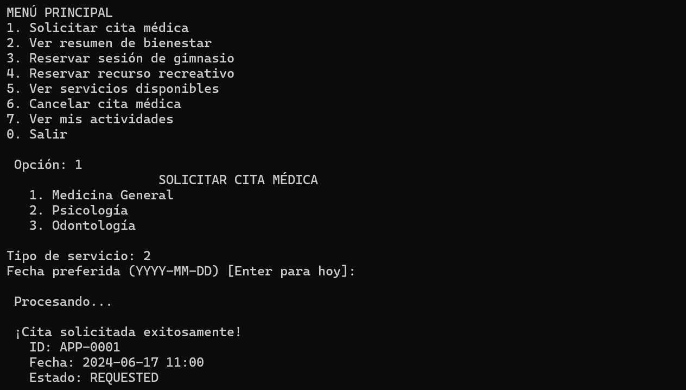

2. Ver resumen de bienestar
    

3. Reservar sesión de gimnasio
    

4. Reservar recurso recreativo
    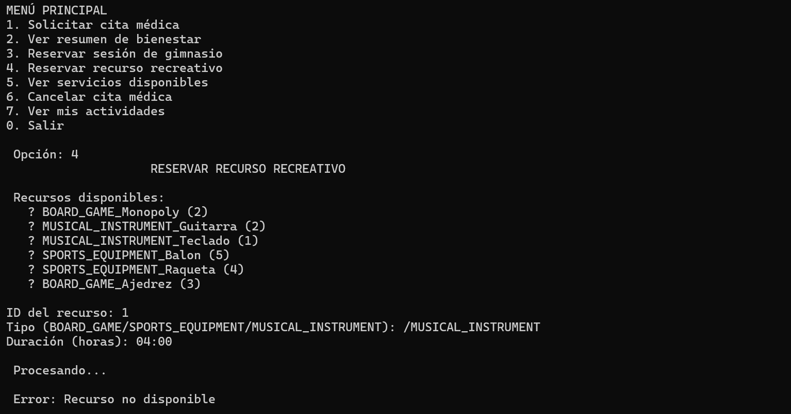

5. Ver servicios disponibles
    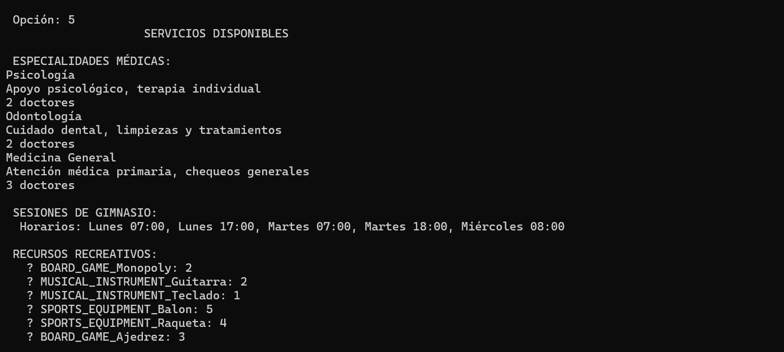

6. Cancelar cita médica
    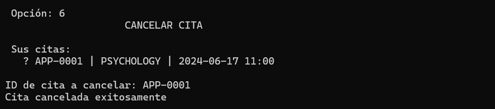

7. Ver mis actividades
    

8. Apagamos un microservicio "Solicitar cita médica"
    


### Preguntas de reflexión
- ¿Qué simplifica el Gateway para el cliente?

    Punto único de entrada: El cliente solo necesita conocer la dirección del Gateway

    Abstracción de complejidad: No sabe cuántos servicios existen ni en qué puertos

    Interfaz unificada: Todas las operaciones usan el mismo estilo de llamada

    Simplificación de errores: El Gateway puede manejar fallos de servicios internos

    Reducción de código: El cliente no necesita implementar lógica de comunicación con múltiples servicios

- ¿Qué complejidad agrega al sistema?

    Punto adicional: Se debe desarrollar, desplegar y mantener el Gateway

    Latencia extra: Cada petición pasa por una capa adicional

    Posible cuello de botella: Todo el tráfico pasa por el Gateway

    Configuración adicional: Se deben configurar las conexiones a los servicios internos

    Single Point of Failure (SPOF): Si el Gateway falla, todo el sistema falla

- ¿Qué pasaría si el Gateway empieza a contener demasiada lógica de negocio?

    Gateway anémico -> Gateway "inteligente": Si contiene mucha lógica, se convierte en un monolito distribuido

    Problemas identificados:

    Acoplamiento fuerte: El Gateway se vuelve dependiente de las reglas de negocio

    Dificultad de escalar: La lógica compleja requiere más recursos

    Mantenimiento complejo: Cambios en reglas de negocio requieren cambios en el Gateway

    Responsabilidades mezcladas: El Gateway debería ser solo de enrutamiento, no de procesamiento

***Mejor práctica***: El Gateway debe ser "tonto" (routing y transformación mínima) y la lógica de negocio debe estar en los microservicios

### Diagrama

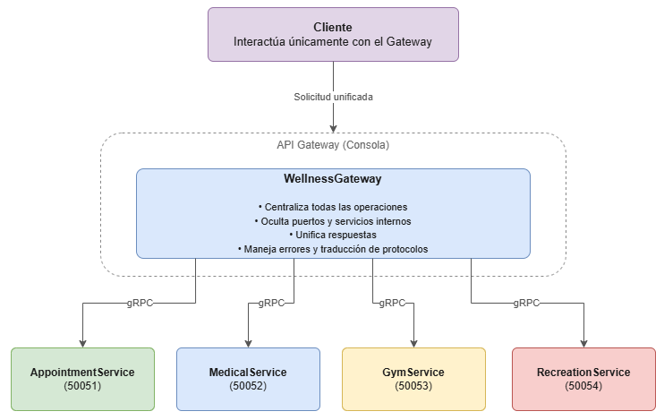


### Plataforma ECICIENCIA

### Descripcion
Como cierre del taller, los estudiantes deben diseñar la arquitectura de una plataforma distribuida para
apoyar la gestión del evento ECICIENCIA. Este ejercicio no exige implementar todo el sistema, pero sí
requiere justificar decisiones arquitectónicas usando los estilos trabajados durante el taller.

### Contexto
La Escuela necesita una plataforma para organizar actividades académicas, talleres, charlas y experiencias tecnológicas durante ECICIENCIA. El sistema debe permitir registrar asistentes, consultar la agenda, reservar talleres y controlar el aforo de cada actividad.

### Funcionalidades mínimas

- Registro de asistentes.
- Consulta de agenda.
- Reserva de cupos en talleres.
- Control de aforo por actividad.
- Consulta de actividades por franja horaria.

### Actividades del ejercicio

- Identifique los microservicios necesarios.
- Defina la responsabilidad de cada microservicio.
- Proponga los contratos gRPC principales.
- Diseñe un API Gateway para centralizar el acceso.
- Elabore un diagrama de arquitectura.
- Justifique por qué no usaría un único servicio monolítico para todo.

### Diagrama Arquitectónico

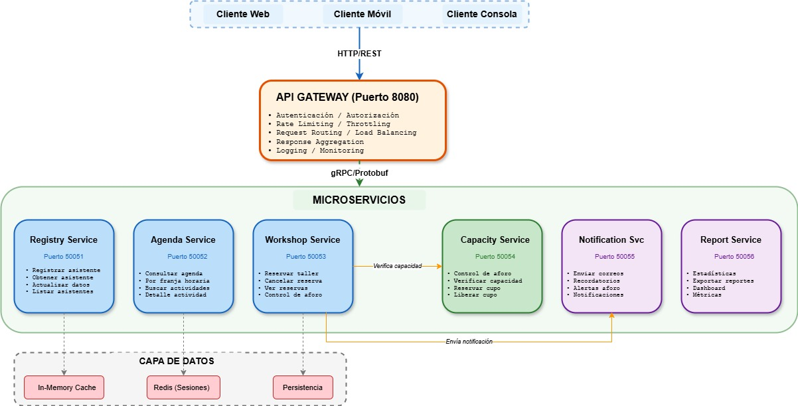

### Lista de Microservicios y Responsabilidades

| Servicio | Puerto | Responsabilidad | Datos que gestiona |
|-----------|---------|----------------|-------------------|
| Registry Service | 50051 | Gestión completa de asistentes (CRUD) | ID, nombre, email, institución, rol, fecha de registro |
| Agenda Service | 50052 | Catálogo de actividades, horarios y ubicaciones | ID de actividad, título, tipo, horario, ubicación, ponente, categoría |
| Workshop Service | 50053 | Reservas de talleres y gestión de participantes | ID de reserva, actividad, asistente, estado, fecha de reserva |
| Capacity Service | 50054 | Control de aforo y disponibilidad | Capacidad total, ocupados y disponibles por actividad |
| Notification Service | 50055 | Comunicaciones con asistentes | Email, tipo de notificación, estado de envío y registros (logs) |
| Report Service | 50056 | Analítica y generación de reportes | Estadísticas, métricas y exportaciones |

### Descripción del ApiGateway

*** Responsabilidades: ***

1. Ruteo de Solicitudes: Dirige cada petición al microservicio correspondiente
2. Agregación de Respuestas: Combina datos de múltiples servicios (ej: agenda + capacidad)
3. Autenticación Simple: Valida sesiones y tokens
4. Rate Limiting: Controla el número de peticiones por cliente
5. Logging Centralizado: Registra todas las operaciones
6. Transformación de Protocolos: Convierte HTTP REST a gRPC interno

*** Endpoints Expuestos: ***

| Método | Endpoint | Función | Servicios Internos |
|---------|----------|----------|-------------------|
| POST | `/api/register` | Registrar asistente | Registry, Notification |
| GET | `/api/agenda` | Consultar agenda | Agenda, Capacity |
| POST | `/api/reserve` | Reservar taller | Workshop, Capacity, Registry, Agenda, Notification |
| GET | `/api/my-reservations` | Ver reservas del asistente | Workshop, Agenda |
| GET | `/api/capacity` | Consultar aforo y disponibilidad | Capacity |
| GET | `/api/dashboard` | Consultar estadísticas globales | Registry, Agenda, Capacity |

### ¿Por qué no usar un monolito?

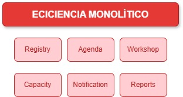

PROBLEMAS:
- Un cambio en registro requiere redeploy completo
- Pico de reservas afecta todo el sistema  
- Equipos trabajan sobre el mismo código base
- Escalamiento horizontal de todo o nada
- Fallo en notificaciones colapsa registros

Ventajas de la arquitectura propuesta

| Aspecto | Monolito | Microservicios |
|----------|----------|----------------|
| Escalabilidad | Escala toda la aplicación conjuntamente | Escala únicamente los servicios con mayor demanda (por ejemplo, Workshop y Capacity) |
| Disponibilidad | Un fallo puede afectar toda la aplicación | Los fallos se aíslan por servicio (por ejemplo, Notification no bloquea registros) |
| Despliegue | Requiere redeploy completo de la aplicación | Permite despliegue independiente de cada servicio |
| Mantenimiento | Alto acoplamiento entre componentes | Bajo acoplamiento y responsabilidades bien definidas |
| Equipos | Todos trabajan sobre el mismo repositorio y código base | Equipos especializados pueden trabajar por dominio o servicio |
| Tecnología | Limitada a una única pila tecnológica | Posibilidad de elegir la tecnología más adecuada para cada servicio |

### evolución arquitectónica del talle

Evolución a lo largo del taller:

```text
Sockets TCP              HTTP                    RMI
Manual protocol      Interoperabilidad      RPC en Java
Alto acoplamiento    Formato estándar       Contrato interfaz
       ↓                    ↓                     ↓
      gRPC           Microservicios         API Gateway
Contrato formal      Responsabilidades      Punto único
Multi-lenguaje       Escalabilidad          Centralización
```

Lecciones aprendidas:
- Cada estilo resuelve problemas específicos
- La complejidad se mueve: Gateway simplifica cliente pero añade punto de orquestación
- El contrato es clave: gRPC y Protocol Buffers formalizan la comunicación
- Escalar requiere desacoplar: Microservicios permiten escalar partes específicas

¿Cuándo usar cada estilo?

| Escenario | Estilo recomendado |
|------------|--------------------|
| Prototipo rápido | HTTP + JSON |
| Sistema interno Java | RMI |
| Sistema crítico con múltiples clientes | gRPC |
| Sistema grande con dominios claros | Microservicios |
| Exposición externa | API Gateway |

### Conclusión

La evolución desde sockets TCP hasta microservicios con API Gateway. Representa el camino natural de maduración de sistemas distribuidos, donde cada capa de abstracción resuelve problemas de la anterior, pero introduce nuevas complejidades que deben gestionarse. Entender estos trade-offs para tomar decisiones informadas según el contexto específico.

El caso ECICIENCIA demuestra que una plataforma con alta concurrencia (inscripciones), necesidades de notificación, control de aforo estricto y múltiples tipos de actividades se beneficia enormemente de una arquitectura de microservicios, donde cada componente puede escalar, evolucionar y fallar independientemente, mientras el Gateway unifica la experiencia para el usuario final.